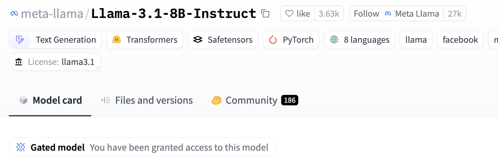
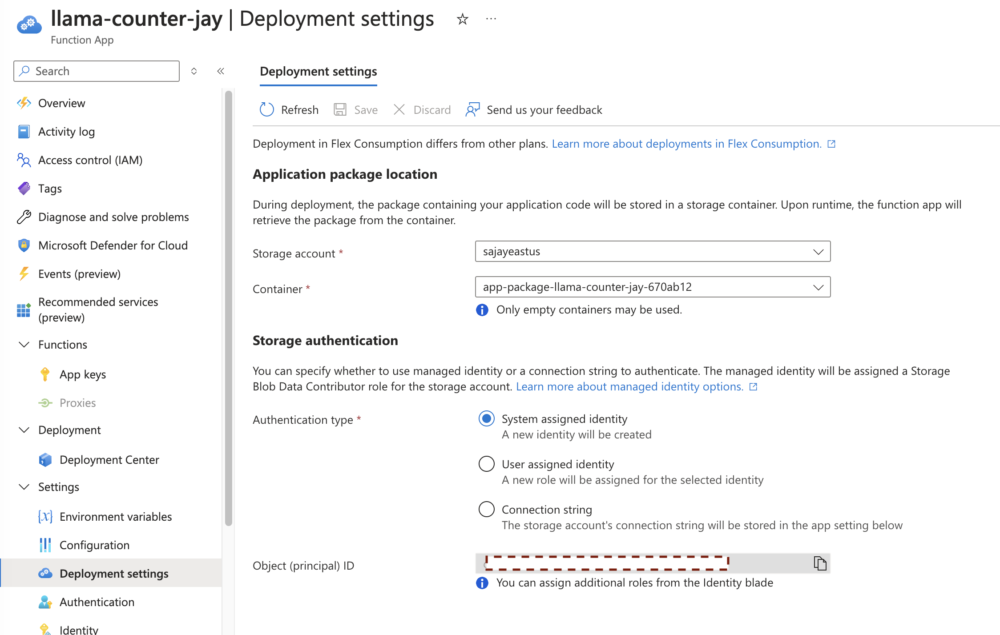
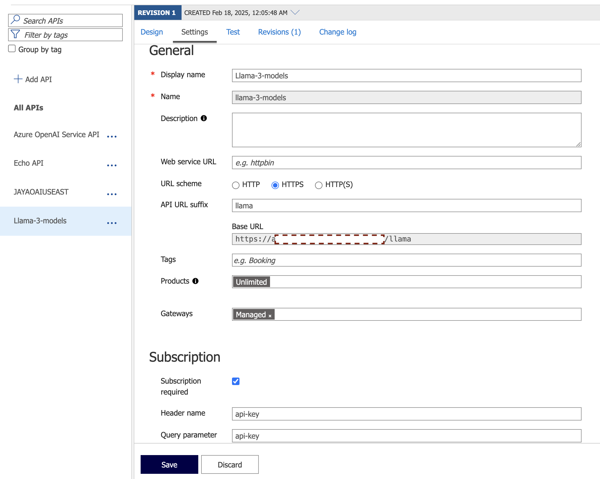
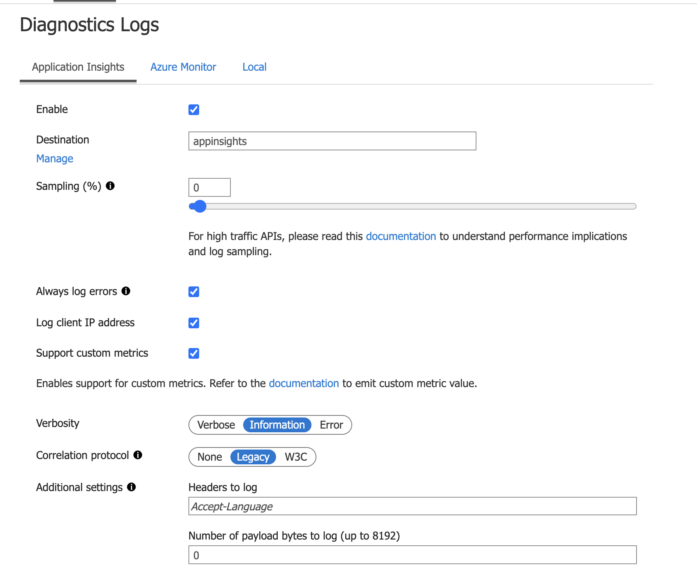
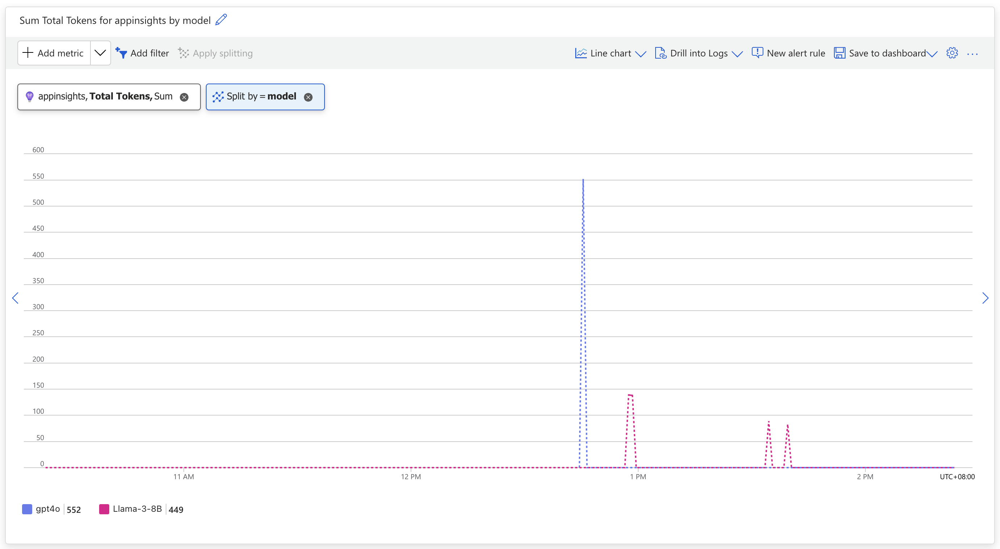

# Token Counter for Llama 3 models on Azure API Management

## AutoTokenizer

AutoTokenizer from Hugging Face is used to count the tokens of the chat completion. The tokenizer is loaded from the model hub using the model name. If model of your choice is gated model, you will need to first go to the model page and request access. Llama 3 models are gated models, so this is required pre-requisite.



## Deploy Azure Function

Highly recommend to use Managed Identity for Storage Account with Azure Function. (https://techcommunity.microsoft.com/blog/appsonazureblog/use-managed-identity-instead-of-azurewebjobsstorage-to-connect-a-function-app-to/3657606)



```bash
func azure functionapp publish llama-counter-jay
```


## Azure API Management Policy

In order to emit metrics to Azure App Insights, we need to configure App Insights as a diagnostic setting in Azure API Management. 





The following policy is an example of how to emit metrics to App Insights.

```xml
<policies>
    <!-- Throttle, authorize, validate, cache, or transform the requests -->
    <inbound>
        <set-backend-service base-url="https://models.inference.ai.azure.com" />
        <set-header name="Authorization" exists-action="override">
            <value>Bearer {{GITHUB-TOKEN}}</value>
        </set-header>
        <set-variable name="RequestBody" value="@(context.Request.Body.As<string>(preserveContent: true))" />
    </inbound>
    <!-- Control if and how the requests are forwarded to services  -->
    <backend>
        <base />
    </backend>
    <!-- Customize the responses -->
    <outbound>
        <base />
        <send-request mode="new" response-variable-name="usage" timeout="20" ignore-error="true">
            <set-url>https://[Function_URL]/api/tokencounter</set-url>
            <set-method>POST</set-method>
            </set-header-->
            <set-header name="Content-Type" exists-action="override">
                <value>application/json</value>
            </set-header>
            <set-body>@{
                    return new JObject(
                            new JProperty("RequestBody", context.Request.Body.As<string>(preserveContent: true)),
                            new JProperty("ResponseBody", context.Response.Body.As<string>(preserveContent: true))
                        ).ToString(Newtonsoft.Json.Formatting.None);
                    }</set-body>
        </send-request>
        <set-variable name="totalTokens" value="@{
                var usage = ((IResponse)context.Variables["usage"]).Body.As<JObject>(preserveContent: true).ToString();
                var responseBody = JObject.Parse(usage);
                var totalTokens = responseBody["usage"]["total_tokens"].ToObject<string>();
                return totalTokens.ToString();
        }" />
        <emit-metric name="Total Tokens" value="@(Convert.ToDouble(context.Variables.GetValueOrDefault<string>("totalTokens")))" namespace="apimjayaoai">
            <dimension name="Subscription ID" />
            <dimension name="Client IP" value="@(context.Request.IpAddress)" />
            <dimension name="model" value="Llama-3-8B" />
        </emit-metric>
    </outbound>
    <!-- Handle exceptions and customize error responses  -->
    <on-error>
        <base />
    </on-error>
</policies>
```

. GITHUB-TOKEN: This is the PAT to access GitHub Models. You can create a PAT from your GitHub account.

## Metrics on App Insights


